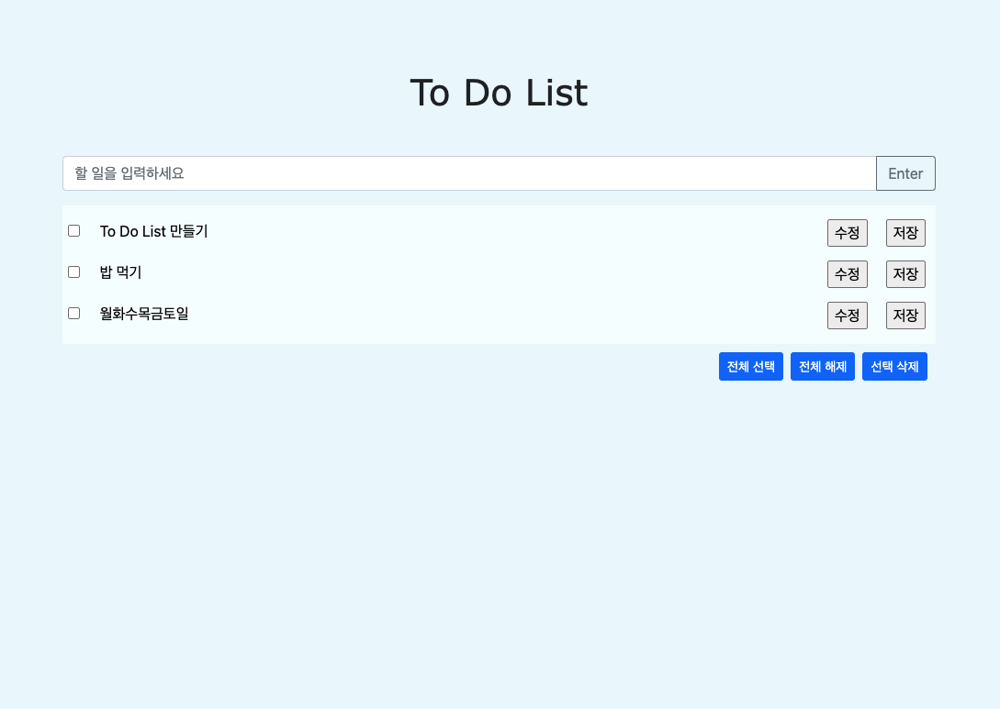

# To Do List
* [ToDoList]("https://github.com/jsw6872/TIL/tree/main/ToDOList")

## javascript Issue

|querySelectorAll|getElementsById|
|:---:|:---:|
|NodeList로 반환|HTMLcollection으로 반환|
|forEach문이 가능하고 정적인 HTML을 들고 오기 떄문에 for문 내에서 변경이 되어도 NodeList 내에 요소가 바뀌지 않음|for문만 되며 삭제나 변경 시에 내용이 그때 그때 바뀐다|
> remove()를 할 때 getElements를 사용 시에 제대로 된 결과를 도출할 수 없다

* 노드 이동
> 노드이동 매소드를 통해 부모 자식 형제 태깅 접근하여 내용을 바꿀 수 있다.

* .checked
> checkbox의 체크 여부를 true, false로 제어가능